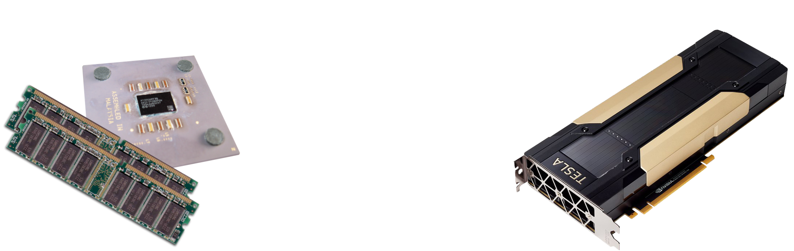
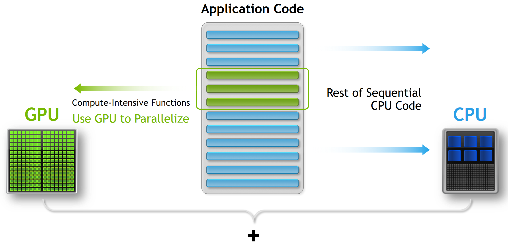
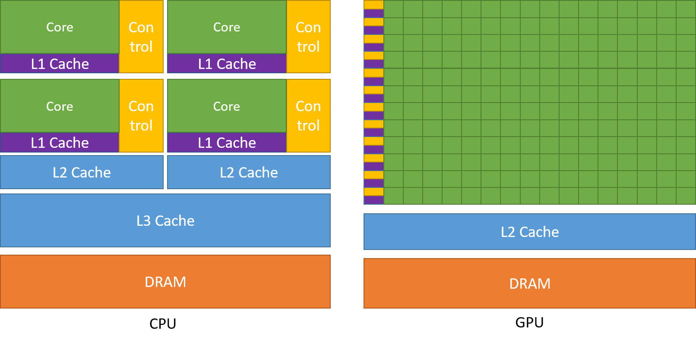
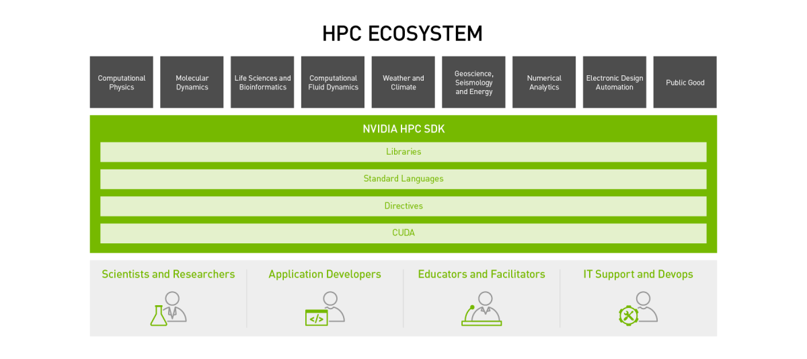
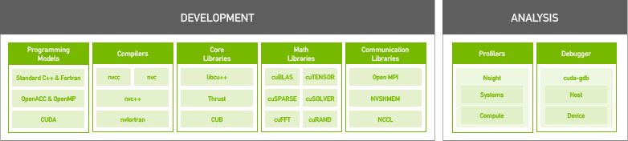
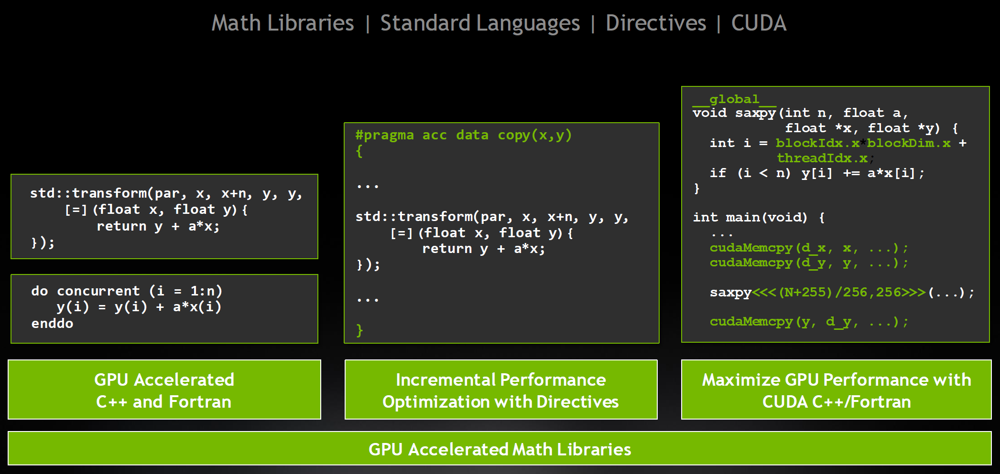
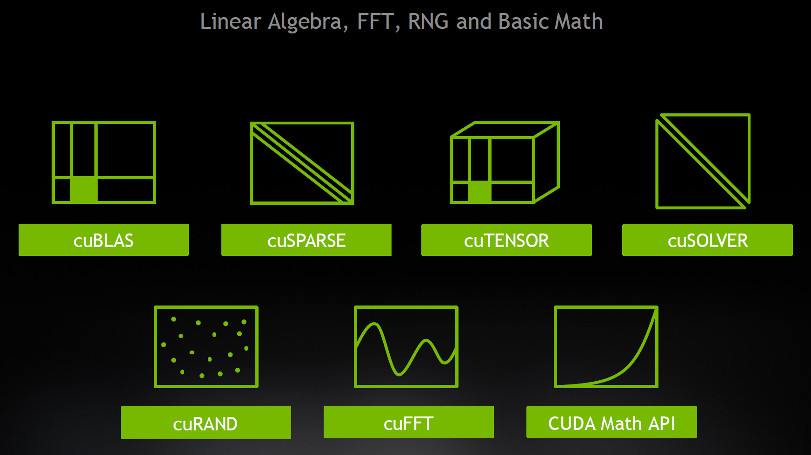

# Introduction to Accelerated Computing
Introduction to basics of CUDA programming, including the ATLAS CUDA Workshop, April 2025.
For more details, refer to the [References](./ATLAS_CUDA_tutorial/References) section, which contains the basics on GPUs and CUDA programming.
Feel free to read them.

### Prerequisites

No GPU knowledge is assumed for this module. Basic knowledge of Fortran or C/C++ is assumed.

# NVIDIA HPC Training Series

This series of labs serves as an introduction to NVIDIA's accelerated computing platform through the use of the [NVIDIA HPC SDK](https://developer.nvidia.com/hpc-sdk).

The target audience of this training series is application developers who have an interest in high-performance computing. Participants are expected to have a basic understanding of C/C++ code, including for loops, conditional expressions, etc., and some prior experience writing C/C++ applications. Participants are also assumed to have basic familiarity with running at the command line in Linux, e.g. for compiling code, although it is not necessary.

Click one of the labs below to get started.

## CUDA

[Lab 1: Introduction to CUDA](ATLAS_CUDA_tutorial/01_Introduction_to_CUDA/01_Introduction_to_CUDA.ipynb)

[Lab 2: Expose Parallelism](ATLAS_CUDA_tutorial/02_Expose_Parallelism/02_Expose_Parallelism.ipynb)

[Lab 3: Coalesce Memory Accesses](ATLAS_CUDA_tutorial/03_Coalesce_Memory_Accesses/03_Coalesce_Memory_Accesses.ipynb)

[Lab 4: Atomics and Reductions](ATLAS_CUDA_tutorial/04_Atomics_and_Reductions/04_Atomics_and_Reductions.ipynb)

[Lab 5: Shared Memory](ATLAS_CUDA_tutorial/05_Shared_Memory/05_Shared_Memory.ipynb)

[Lab 6: Reductions Redux](ATLAS_CUDA_tutorial/06_Reductions_Redux/06_Reductions_Redux.ipynb)

[Lab 7: Managed Memory](ATLAS_CUDA_tutorial/07_Managed_Memory/07_Managed_Memory.ipynb)

[Lab 8: Concurrency with Streams](ATLAS_CUDA_tutorial/08_Concurrency_with_Streams/08_Concurrency_with_Streams.ipynb)

[Lab 9: Performance Analysis](ATLAS_CUDA_tutorial/09_Performance_Analysis/09_Performance_Analysis.ipynb)

## Heterogeneous and Accelerated Computing

Heterogeneous computing involves using multiple different types of processors to accomplish a task. In this module we'll be focusing on how to use both CPUs and GPUs together to solve a problem.

In common accelerated computing parlance, we refer to the CPU as the **host** and the GPU as the **device**. GPUs have their own memory (RAM) which is distinct from the CPU's memory on most accelerated computing architectures. We refer to the CPU's memory as **host memory** and the GPU's memory as **device memory**.

In accelerated computing we take the compute intensive parts of the application code, usually the part of the code where we are spending the most time, and parallelize that for execution on a GPU. The remainder of the code (which may be the vast majority of the number of lines of code) remains on the CPU. Ideally, the part of the code that remains on the CPU is traditional serial code such as input/output operations and high level control flow. The part of the code that makes the most sense to put on the GPU is the operations involving a substantial amount of compute work (typically integer or floating point mathematical operations). In particular, the work that goes onto the GPU must be highly parallelizable. This division of labor reflects the fact that CPUs have complex compute cores (that can execute many types of instructions) but relatively few of them, while GPUs have simple compute cores (that execute a more limited instruction set) but relatively many of them. A modern high end server class CPU typically has on the order of tens of cores, while a modern high end server class GPU has thousands of cores, so we really must adopt some method of parallel computing to effectively use the GPU.

The image above demonstrates the fundamental difference between a CPU and GPU: given the same amount of physical area on a computer chip (or, thought of another way, the number of transistors on the chip), GPUs preferentially devote their area to large amounts of fairly simplistic data processing components, while CPUs tend to devote more of their area to large caches and complex control flow components.

## NVIDIA HPC SDK

The NVIDIA [HPC SDK](https://developer.nvidia.com/hpc-sdk) is a comprehensive suite of developer tools for accelerated HPC. It includes the C, C++, and Fortran compilers, libraries, and analysis tools necessary for developing HPC applications on the NVIDIA platform.

Programming with the HPC SDK can involve one of several approaches, depending on your concern for productivity and performance. Options range from native acceleration in the languages -- [C++ parallel algorithms](https://docs.nvidia.com/hpc-sdk/compilers/c++-parallel-algorithms/index.html), starting with C++17, and Fortran `do concurrent` starting with Fortran 2008 -- to directive-based programming (hints provided to the compiler to accelerate a specific compute workload) and low-level programming in CUDA to achieve maximum performance.

For many problems, off-the-shelf vendor libraries are an easy way to achieve acceleration, particularly with linear algebra problems, FFTs, and random number generation. NVIDIA provides several math libraries that offer drop-in acceleration on GPUs, often with similar or identical APIs to what you are familiar with on CPUs.

## Review

In this module we have learned:

- The difference between host (CPU) and device (GPU) architectures
- Accelerated computing models offered by the NVIDIA HPC SDK

## Further Study

- [NVIDIA CUDA C++ Programming Guide](https://docs.nvidia.com/cuda/cuda-c-programming-guide/index.html)
- [An Easy Introduction to CUDA C and C++](https://developer.nvidia.com/blog/easy-introduction-cuda-c-and-c/)
- [An Even Easier Introduction to CUDA](https://developer.nvidia.com/blog/even-easier-introduction-cuda/)
- [NVIDIA HPC Developer Site](https://developer.nvidia.com/hpc)
